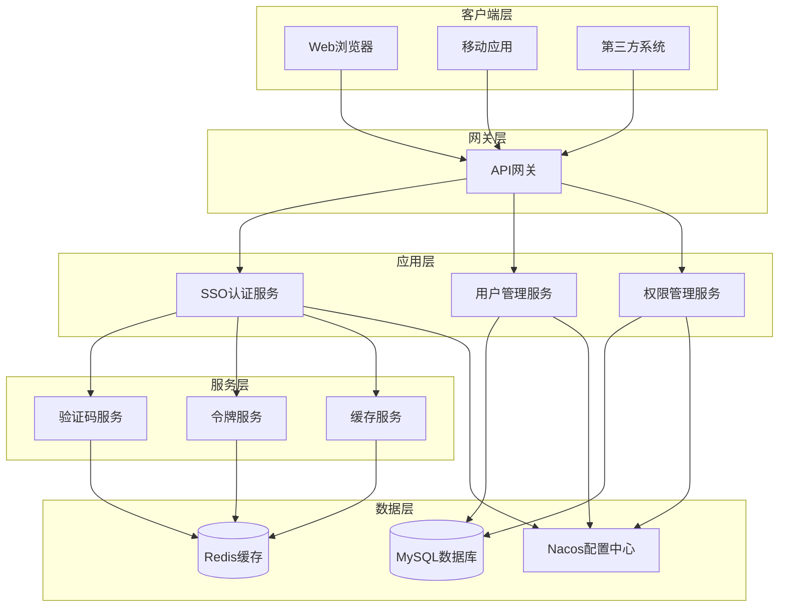
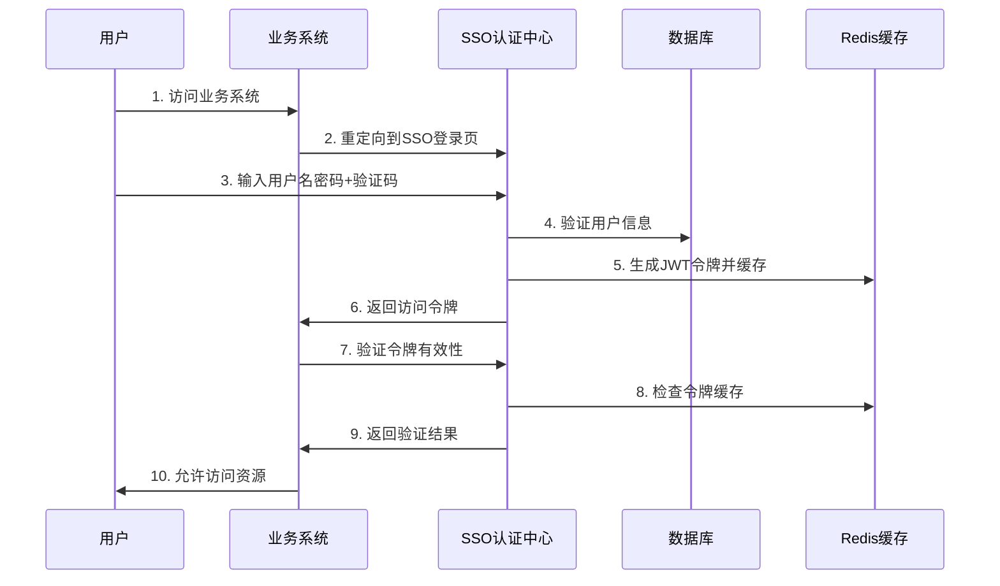

# CH-SSO 企业级单点登录系统

<div align="center">


**基于Spring Boot + Spring Security构建的企业级单点登录(SSO)系统**

[项目介绍](#项目介绍) • [核心特性](#核心特性) • [技术架构](#技术架构) • [快速开始](#快速开始) • [API文档](#api文档) • [部署指南](#部署指南)

</div>

---

## 📋 项目介绍

CH-SSO（朝华SingleSignOn）是一个基于Spring Boot + Spring Security构建的企业级单点登录系统，采用OAuth2.0协议标准，为企业提供统一的身份认证和授权服务。

### 🎯 核心价值

- **统一认证**：一次登录，访问所有业务系统
- **安全可靠**：基于JWT令牌，支持多种验证码防护
- **高可用性**：支持分布式部署，Redis集群缓存
- **易于集成**：提供丰富的API接口和客户端SDK
- **可扩展性**：支持自定义验证码类型和缓存策略

### 🔐 工作原理

单点登录的核心原理是：用户在SSO服务器完成身份认证后，获得访问令牌(ST)，业务系统通过验证该令牌的有效性来确认用户身份，从而实现一次登录访问多个系统的目标。

```
用户 → 业务系统 → SSO认证中心 → 生成Token → 业务系统验证Token → 资源访问
```

## ✨ 核心特性

### 🔑 认证授权
- **OAuth2.0协议**：支持密码模式、授权码模式
- **JWT令牌**：无状态令牌，支持分布式验证
- **多因子认证**：支持用户名密码+验证码双重认证
- **令牌管理**：自动刷新、过期处理、安全注销

### 🛡️ 安全防护
- **多种验证码**：图形验证码、滑动拼图、点选文字
- **密码加密**：BCrypt加密存储，防止明文泄露
- **防暴力破解**：登录失败次数限制
- **会话管理**：支持单点登出，会话同步

### 🏗️ 架构设计
- **微服务架构**：基于Spring Cloud生态
- **服务注册发现**：集成Nacos注册中心
- **配置中心**：统一配置管理，支持动态更新
- **缓存策略**：Redis集群缓存，提升性能

### 📊 监控运维
- **健康检查**：应用状态监控
- **日志记录**：详细的操作日志和审计日志
- **性能监控**：接口响应时间统计
- **告警机制**：异常情况实时告警

## 🏛️ 技术架构

### 整体架构图



### 模块结构

```
ch-sso/
├── client/                 # 客户端SDK
│   ├── sso-client/        # SSO客户端接口
│   └── api-client/        # API客户端接口
├── dao/                   # 数据访问层
│   ├── domain/           # 实体类
│   ├── mapper/           # MyBatis映射器
│   └── dto/              # 数据传输对象
├── service/              # 业务服务层
│   ├── service/          # 业务服务接口
│   └── props/            # 配置属性
└── web/                  # Web应用层
    ├── controller/       # 控制器
    ├── security/         # 安全配置
    ├── captcha/          # 验证码服务
    ├── biz/              # 业务逻辑
    └── utils/            # 工具类
```

### 认证流程图



## 🚀 快速开始

### 环境要求

- **JDK**: 1.8+
- **Maven**: 3.6+
- **MySQL**: 8.0+
- **Redis**: 6.0+
- **Nacos**: 2.0+

### 1. 克隆项目

```bash
git clone https://gitee.com/ch-cloud/ch-sso.git
cd ch-sso
```

### 2. 数据库初始化

```sql
-- 创建数据库
CREATE DATABASE ch_devops CHARACTER SET utf8mb4 COLLATE utf8mb4_unicode_ci;

-- 执行SQL脚本（按顺序）
-- 1.0.0版本脚本
source xxx/db/1.0.0/oauth_client_details.sql
source xxx/db/1.0.0/PERSISTENT_TOKEN.sql

-- 2.0.0版本脚本
source xxx/db/2.0.0/01_bt_api_project.sql
source xxx/db/2.0.0/02_bt_api_group.sql
source xxx/db/2.0.0/03_bt_api_path.sql
source xxx/db/2.0.0/04_bt_api_schema.sql
source xxx/db/2.0.0/05_rt_api_group_path.sql
source xxx/db/2.0.0/06_bt_api_permission.sql
source xxx/db/2.0.0/07_bt_api_version.sql
source xxx/db/2.0.0/08_bt_api_log.sql
source xxx/db/2.0.0/09_rt_api_project_user.sql
source xxx/db/2.0.0/10_bt_api_share_code.sql
```

### 3. 配置修改

#### 数据库配置 (`web/src/main/resources/config/application-local.yml`)

```yaml
spring:
  datasource:
    url: jdbc:mysql://localhost:3306/ch_devops?characterEncoding=UTF-8&serverTimezone=Asia/Shanghai
    username: your_username
    password: your_password
  redis:
    host: localhost
    port: 6379
    password: your_redis_password
    database: 1
```

#### Nacos配置 (`web/src/main/resources/bootstrap.yml`)

```yaml
nacos:
  config:
    server-addr: localhost:8848
    namespace: local
```

#### JWT配置

```yaml
jwt:
  secret: your_jwt_secret_key_here
  tokenExpired: 30m
  refreshTokenExpired: 1d
```

### 4. 编译运行

```bash
# 编译项目
mvn clean compile

# 打包项目
mvn clean package -DskipTests

# 运行项目
cd web
mvn spring-boot:run
```

### 5. 验证部署

访问以下地址验证部署是否成功：

- **登录页面**: http://localhost:7000/login
- **API文档**: http://localhost:7000/swagger-ui/index.html
- **健康检查**: http://localhost:7000/actuator/health

## 📚 API文档

### 认证相关接口

#### 用户登录
```http
POST /login/access
Content-Type: application/json

{
  "username": "admin",
  "password": "123456",
  "captchaCode": "8a3d"
}
```

#### 获取验证码
```http
POST /captcha/get
Content-Type: application/json

{
  "captchaType": "blockPuzzle"
}
```

#### 验证令牌
```http
GET /fc/login/token/validate
Authorization: Bearer {token}
```

#### 刷新令牌
```http
GET /login/token/refresh
X-Token: {access_token}
X-Refresh-Token: {refresh_token}
```

### 用户管理接口

#### 获取用户信息
```http
GET /fc/login/token/info
Authorization: Bearer {token}
```

#### 用户登出
```http
POST /logout/token
Authorization: Bearer {token}
```

### 完整API列表

| 接口 | 方法 | 描述 | 认证 |
|------|------|------|------|
| `/login` | GET | 获取登录页面 | 否 |
| `/login/access` | POST | 用户登录 | 否 |
| `/login/auth-code` | GET | 获取授权码 | 否 |
| `/login/token/refresh` | GET | 刷新令牌 | 是 |
| `/captcha/get` | POST | 获取验证码 | 否 |
| `/captcha/check` | POST | 验证验证码 | 否 |
| `/fc/login/token/validate` | GET | 验证令牌 | 是 |
| `/fc/login/token/info` | GET | 获取用户信息 | 是 |
| `/fc/login/token/renew` | GET | 续期令牌 | 是 |
| `/logout/token` | POST | 注销令牌 | 是 |

## 🔧 配置说明

### 验证码配置

```yaml
captcha:
  type: DEFAULT                    # 验证码类型：DEFAULT/CLICK_WORD/BLOCK_PUZZLE
  cache-type: redis               # 缓存类型：local/redis/caffeine
  water-mark: "CH-SSO"            # 水印文字
  water-font: "宋体"              # 水印字体
  font-type: "宋体"               # 验证码字体
  slip-offset: 5                  # 滑动验证误差偏移量
  aes-status: true                # AES加密状态
  interference-options: 2         # 滑动干扰项
  jigsaw: classpath:static/images/jigsaw
  pic-click: classpath:static/images/pic-click
```

### 安全配置

```yaml
spring:
  security:
    oauth2:
      client:
        registration:
          sso:
            client-id: ch-sso
            client-secret: ch-sso-secret
            authorization-grant-type: authorization_code
            redirect-uri: "{baseUrl}/login/oauth2/code/{registrationId}"
```

### 缓存配置

```yaml
spring:
  redis:
    host: localhost
    port: 6379
    password: your_password
    database: 1
    timeout: 60000
    jedis:
      pool:
        max-active: 9
        max-wait: -1
        max-idle: 9
        min-idle: 0
```

## 🐳 部署指南

### Docker部署

```bash
# 构建镜像
docker build -t ch-sso:latest .

# 运行容器
docker run -d \
  --name ch-sso \
  -p 7000:7000 \
  -e SPRING_PROFILES_ACTIVE=prod \
  -e MYSQL_HOST=your_mysql_host \
  -e REDIS_HOST=your_redis_host \
  ch-sso:latest
```

### Kubernetes部署

```yaml
apiVersion: apps/v1
kind: Deployment
metadata:
    name: ch-sso
spec:
  replicas: 3
  selector:
    matchLabels:
      app: ch-sso
  template:
    metadata:
      labels:
        app: ch-sso
    spec:
      containers:
      - name: ch-sso
        image: ch-sso:latest
        ports:
        - containerPort: 7000
        env:
        - name: SPRING_PROFILES_ACTIVE
          value: "prod"
        - name: MYSQL_HOST
          value: "your_mysql_host"
        - name: REDIS_HOST
          value: "your_redis_host"
```

### 生产环境配置

1. **数据库配置**
   - 使用主从复制
   - 配置连接池参数
   - 定期备份数据

2. **Redis配置**
   - 使用Redis集群
   - 配置持久化
   - 设置内存策略

3. **安全配置**
   - 修改默认密码
   - 配置HTTPS
   - 设置防火墙规则

4. **监控配置**
   - 集成Prometheus监控
   - 配置日志收集
   - 设置告警规则

## 🔍 故障排查

### 常见问题

1. **登录失败**
   - 检查用户名密码是否正确
   - 验证验证码是否有效
   - 查看数据库连接是否正常

2. **令牌验证失败**
   - 检查令牌是否过期
   - 验证Redis连接是否正常
   - 确认JWT密钥配置

3. **验证码显示异常**
   - 检查图片资源路径
   - 验证缓存服务状态
   - 查看日志错误信息

### 日志分析

```bash
# 查看应用日志
tail -f web/target/logs/ch-sso.log

# 查看错误日志
grep "ERROR" web/target/logs/ch-sso.log

# 查看认证日志
grep "AUTH" web/target/logs/ch-sso.log
```

## 🤝 参与贡献

我们欢迎所有形式的贡献，包括但不限于：

- 🐛 Bug报告
- 💡 功能建议
- 📝 文档改进
- 🔧 代码贡献

### 贡献流程

1. Fork 本仓库
2. 创建特性分支 (`git checkout -b feature/AmazingFeature`)
3. 提交更改 (`git commit -m 'Add some AmazingFeature'`)
4. 推送到分支 (`git push origin feature/AmazingFeature`)
5. 创建 Pull Request

### 开发环境搭建

```bash
# 克隆项目
git clone https://gitee.com/ch-cloud/ch-sso.git

# 安装依赖
mvn clean install

# 运行测试
mvn test

# 启动开发环境
mvn spring-boot:run -pl web
```

## 📄 开源协议

本项目采用 [Apache License 2.0](LICENSE) 开源协议。

## 📞 联系我们

- **项目地址**: https://gitee.com/ch-cloud/ch-sso
- **文档地址**: https://gitee.com/ch-cloud/wiki
- **问题反馈**: https://gitee.com/ch-cloud/ch-sso/issues
- **邮箱**: support@ch-cloud.com

## 🙏 致谢

感谢以下开源项目的支持：

- [Spring Boot](https://spring.io/projects/spring-boot)
- [Spring Security](https://spring.io/projects/spring-security)
- [Nacos](https://nacos.io/)
- [Redis](https://redis.io/)
- [MyBatis Plus](https://mybatis.plus/)

---

<div align="center">

**如果这个项目对您有帮助，请给我们一个 ⭐️ Star**

</div>

## 🛠️ 开发指南

### 项目结构详解

```
ch-sso/
├── client/                          # 客户端SDK模块
│   ├── pom.xml
│   └── src/main/java/com/ch/cloud/
│       ├── api/                     # API相关
│       │   ├── client/             # API客户端
│       │   ├── enums/              # 枚举定义
│       │   └── pojo/               # 数据传输对象
│       ├── json/                    # JSON处理
│       │   ├── dto/                # JSON DTO
│       │   └── enums/              # JSON枚举
│       └── sso/                     # SSO相关
│           ├── client/             # SSO客户端
│           └── pojo/               # SSO数据传输对象
├── dao/                             # 数据访问层
│   ├── pom.xml
│   └── src/main/java/com/ch/cloud/api/
│       ├── domain/                 # 实体类
│       ├── dto/                    # 数据传输对象
│       ├── mapper/                 # MyBatis映射器
│       └── mapper2/                # 扩展映射器
├── service/                         # 业务服务层
│   ├── pom.xml
│   └── src/main/java/com/ch/cloud/
│       ├── api/                    # API服务
│       │   ├── service/           # 服务接口
│       │   └── props/             # 配置属性
│       └── sso/                    # SSO服务
│           ├── dto/               # SSO DTO
│           └── props/             # SSO配置
└── web/                            # Web应用层
    ├── pom.xml
    └── src/main/java/com/ch/cloud/
        ├── api/                    # API控制器
        │   ├── annotation/        # 自定义注解
        │   ├── aspect/            # AOP切面
        │   ├── conf/              # 配置类
        │   ├── controller/        # 控制器
        │   ├── manager/           # 业务管理器
        │   └── utils/             # 工具类
        └── sso/                    # SSO核心
            ├── biz/               # 业务逻辑
            ├── captcha/           # 验证码服务
            ├── conf/              # SSO配置
            ├── controller/        # SSO控制器
            ├── security/          # 安全配置
            ├── utils/             # SSO工具类
            └── SsoApplication.java # 启动类
```

### 核心组件说明

#### 1. 认证流程组件

- **LoginController**: 处理用户登录请求
- **TokenManager**: 管理JWT令牌的生成、验证、刷新
- **UserManager**: 处理用户认证和授权
- **CaptchaService**: 提供多种验证码服务

#### 2. 安全组件

- **SecurityConfig**: Spring Security配置
- **JwtLoginFilter**: JWT登录过滤器
- **JwtAuthenticationTokenFilter**: JWT认证过滤器
- **UserDetailsServiceImpl**: 用户详情服务

#### 3. 验证码组件

- **CaptchaServiceFactory**: 验证码服务工厂
- **BlockPuzzleCaptchaServiceImpl**: 滑动拼图验证码
- **ClickWordCaptchaServiceImpl**: 点选文字验证码
- **CaptchaCacheService**: 验证码缓存服务

### 扩展开发

#### 自定义验证码类型

1. 实现 `CaptchaService` 接口
2. 在 `META-INF/services/` 中注册服务
3. 配置验证码类型

```java
@Service
public class CustomCaptchaServiceImpl implements CaptchaService {
    
    @Override
    public String captchaType() {
        return "custom";
    }
    
    @Override
    public CaptchaVO get(CaptchaVO captchaVO) {
        // 实现自定义验证码生成逻辑
        return captchaVO;
    }
    
    // 实现其他方法...
}
```

#### 自定义缓存策略

```java
@Component
public class CustomCacheServiceImpl implements CaptchaCacheService {
    
    @Override
    public String type() {
        return "custom";
    }
    
    @Override
    public void set(String key, CaptchaVO value) {
        // 实现自定义缓存逻辑
    }
    
    // 实现其他方法...
}
```

## 🧪 测试指南

### 单元测试

```bash
# 运行所有测试
mvn test

# 运行特定测试类
mvn test -Dtest=LoginControllerTest

# 运行特定测试方法
mvn test -Dtest=LoginControllerTest#testLoginSuccess
```

### 集成测试

```bash
# 运行集成测试
mvn verify

# 跳过测试
mvn package -DskipTests
```

### API测试

使用Postman或curl进行API测试：

```bash
# 测试登录接口
curl -X POST http://localhost:7000/login/access \
  -H "Content-Type: application/json" \
  -d '{
    "username": "admin",
    "password": "123456",
    "captchaCode": "test123"
  }'

# 测试令牌验证
curl -X GET http://localhost:7000/fc/login/token/validate \
  -H "Authorization: Bearer YOUR_TOKEN_HERE"
```

### 性能测试

使用JMeter进行性能测试：

1. 创建测试计划
2. 添加线程组
3. 配置HTTP请求
4. 设置断言和监听器
5. 运行测试并分析结果

## ⚡ 性能优化

### 数据库优化

1. **索引优化**
   ```sql
   -- 为常用查询字段添加索引
   CREATE INDEX idx_username ON users(username);
   CREATE INDEX idx_token ON tokens(token);
   ```

2. **连接池配置**
   ```yaml
   spring:
     datasource:
       hikari:
         maximum-pool-size: 20
         minimum-idle: 5
         connection-timeout: 30000
         idle-timeout: 600000
         max-lifetime: 1800000
   ```

### Redis优化

1. **内存配置**
   ```yaml
   spring:
     redis:
       jedis:
         pool:
           max-active: 20
           max-idle: 10
           min-idle: 5
   ```

2. **缓存策略**
   ```java
   // 设置合理的过期时间
   redisTemplate.opsForValue().set(key, value, Duration.ofMinutes(30));
   ```

### JVM优化

```bash
# 生产环境JVM参数
java -Xms2g -Xmx4g \
     -XX:+UseG1GC \
     -XX:MaxGCPauseMillis=200 \
     -XX:+HeapDumpOnOutOfMemoryError \
     -jar ch-sso-web.jar
```

## 🔒 安全最佳实践

### 1. 密码安全

- 使用BCrypt加密存储密码
- 设置密码复杂度要求
- 定期更换密码

### 2. 令牌安全

- 设置合理的令牌过期时间
- 使用HTTPS传输令牌
- 实现令牌撤销机制

### 3. 验证码安全

- 限制验证码尝试次数
- 设置验证码过期时间
- 使用加密传输验证码

### 4. 接口安全

- 实现接口限流
- 添加请求签名验证
- 记录安全审计日志

## 📊 监控告警

### 应用监控

```yaml
management:
  endpoints:
    web:
      exposure:
        include: health,info,metrics,prometheus
  endpoint:
    health:
      show-details: always
```

### 业务监控

```java
@Component
public class BusinessMetrics {
    
    private final MeterRegistry meterRegistry;
    
    public BusinessMetrics(MeterRegistry meterRegistry) {
        this.meterRegistry = meterRegistry;
    }
    
    public void recordLoginAttempt(String username, boolean success) {
        Counter.builder("login.attempts")
               .tag("username", username)
               .tag("success", String.valueOf(success))
               .register(meterRegistry)
               .increment();
    }
}
```

### 告警配置

```yaml
# Prometheus告警规则
groups:
  - name: ch-sso
    rules:
      - alert: HighErrorRate
        expr: rate(http_requests_total{status=~"5.."}[5m]) > 0.1
        for: 5m
        labels:
          severity: warning
        annotations:
          summary: "High error rate detected"
```

## 🚀 部署优化

### 1. 容器化部署

```dockerfile
# 多阶段构建
FROM maven:3.8-openjdk-8 AS builder
WORKDIR /app
COPY . .
RUN mvn clean package -DskipTests

FROM openjdk:8-jre-alpine
WORKDIR /app
COPY --from=builder /app/web/target/*.jar app.jar
EXPOSE 7000
ENTRYPOINT ["java", "-jar", "app.jar"]
```

### 2. 负载均衡

```nginx
upstream ch-sso {
    server 192.168.1.10:7000;
    server 192.168.1.11:7000;
    server 192.168.1.12:7000;
}

server {
    listen 80;
    server_name sso.example.com;
    
    location / {
        proxy_pass http://ch-sso;
        proxy_set_header Host $host;
        proxy_set_header X-Real-IP $remote_addr;
    }
}
```

### 3. 数据库集群

```yaml
# MySQL主从配置
spring:
  datasource:
    master:
      url: jdbc:mysql://master:3306/ch_devops
    slave:
      url: jdbc:mysql://slave:3306/ch_devops
```

## 📈 版本更新

### 版本历史

| 版本 | 发布日期 | 主要更新 |
|------|----------|----------|
| 2.1.0 | 2024-01 | 新增滑动验证码、优化性能 |
| 2.0.0 | 2023-12 | 重构架构、支持微服务 |
| 1.0.0 | 2023-06 | 初始版本发布 |

### 升级指南

1. **备份数据**
   ```bash
   mysqldump -u root -p ch_devops > backup.sql
   ```

2. **停止服务**
   ```bash
   systemctl stop ch-sso
   ```

3. **更新代码**
   ```bash
   git pull origin main
   mvn clean package
   ```

4. **执行迁移脚本**
   ```bash
   mysql -u root -p ch_devops < migration.sql
   ```

5. **重启服务**
   ```bash
   systemctl start ch-sso
   ```

## 🤝 社区支持

### 问题反馈

如果您在使用过程中遇到问题，请通过以下方式反馈：

1. **GitHub Issues**: 提交详细的问题描述
2. **邮件支持**: support@ch-cloud.com
3. **QQ群**: 123456789

### 贡献指南

我们欢迎所有形式的贡献：

1. **代码贡献**: 提交Pull Request
2. **文档贡献**: 完善文档和示例
3. **问题报告**: 报告Bug和提出建议
4. **功能建议**: 提出新功能需求

### 开发规范

- 遵循阿里巴巴Java开发手册
- 使用统一的代码格式化配置
- 编写完整的单元测试
- 提交清晰的Commit信息

---

<div align="center">

**CH-SSO - 让身份认证更简单、更安全**

Made with ❤️ by CH-Cloud Team

</div>
